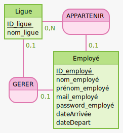

<h1> 

Projet Gestion d'employés

 
BTS SIO SLAM2 

</h1>

<h3> Groupe A </h3>

<a href="https://github.com/ounissaSadaoui"> Ounissa Sadaoui</a> /
<a href="https://github.com/cynthiaapura"> Cynthia Apura</a>

Bienvenue dans la page de documentation de notre Projet  

<h3> Sommaire : </h3>

1. <a href="intro"> Introduction </a>

<h1> 

Introduction
</h1>

Notre application est intitulée :<b> Ligues Dynamiques et Organisées, LDO.</b> 
C'est une application de bureau qui permet aux administrateurs de ligues de gérer leurs employés.

<h1> 

Technologies utilsées</h1>

Pour notre déveoppement, nous avons utilisé:

 * Eclipse IDE comme environnement de développement
 * Java, comme langage de développement
 * mysql pour la base de données
 * phpmyadmin pour la gestion de la base de données
 * GitHub / GitHub Desktop pour le versionnement.

<h1>

Étapes de réalisation</h1>

Nous avons reçu un projet à trous, c'est à dire avec des classes et méthodes manquantes, et sans liaison à une base de données. mais qui fonctionne en lignes de commande

* Nous avons donc commencé par rédiger <b>l'arbre heuristique </b> de notre application, qui ressence nos différents menus, pour en avoir une vision plus claire, et pour pouvoir le modifier sans problèmes.

* Nous avons ensuite réalisé le <b>Modèle Conceptuel des Données </b> de l'application, sur le site Mocodo.
Nous avons choisis de représenter le sujet avec deux tables: ligues et employes, comme suit.                                              

* Nous nous sommes ensuite mises aux modifications fonctionnelles, en premier l'ajout des champs <b>dates d'arrivée et de départ aux employés</b>, puis plusieurs autre ajouts, comme la possibilité d'ajouter un administrateur à une ligue en ligne de commande.

* Une fois que tous nos constructeurs étaient prêts et fonctionnels, nous avons écrit nos <b>tests unitaires,</b> avec <b>JUnit</b>.

* Est ensuite venue l'étape importante de la <b>liaison de notre projet à notre base de données</b>. Nous avons suivi ces étapes.
  * Rédaction d'un <b>script </b> de création de tables
  * Complétion de notre ficher <b>credientials.java </b>, non versionné
  * Utilisation de <b> JDBC </b>, pour lier le projet à la base (Java DataBase Connectivity)
* Une fois notre projet lié à notre base, nous avons pu implémenter plusieurs nouvelles fonctionnalités: 
  * Insertion / lecture du <b>root </b>
  * Insertion / Lecture / suppression des <b> Ligues et des employés </b>

* Nous somme ensuite passées à l'<b>interface Graphique</b>, que nous avons choisis de faire avec <b>javaSwing</b> .
Voici un exemple de fenêtre de notre interface:

